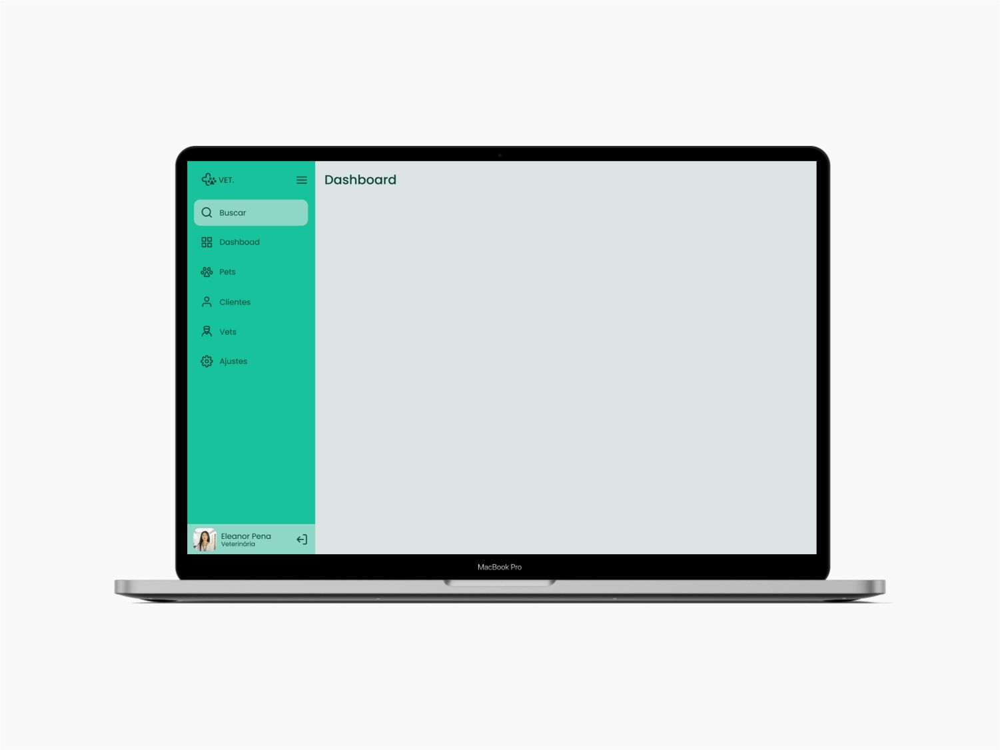
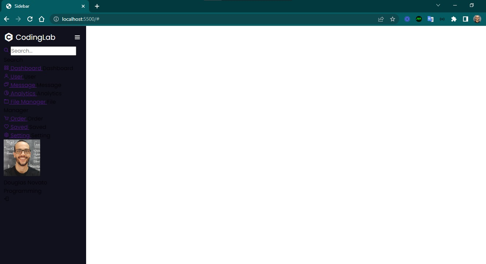

<h4 align="center"> 
	🚧 Sidebar 🚀
</h4>

<p align="center" style="display: flex; align-items: flex-start; justify-content: center;">
  
</p>  

### 💻 Sobre o desafio

Neste desafio você deve criar uma sidebar. Quando o usuário clicar no ícone do menu isso deve fazer com que o estado da sidebar mude entre "aberto", mostrando ícones e texto e "fechado", mostrando apenas os ícones. Utilizando HTML, CSS e Javascript.

#### 💻 Techs

- Nível de dificuldade: Intermediário
- Tecnologias: HTML, CSS e Javascript.

#### 💻 Como começar?

1 - Use o link do [Figma](https://www.figma.com/file/qOlC6p8VYPoU25CDIaKI25/DD-Sidebar-Responsiva-Copy?fuid=850142401757702475) como base para o projeto. Também disponibilizamos para download todos os assets necessários (imagens e ícones), para fazer o download basta clicar no link acima.  

2 - Leia com atenção todas as instruções do desafio.

3 - Bora codar! Lembre-se que você pode usar as tecnologias que se sentir mais confortável, mas também pode se desafiar usando novas techs, fazendo modificações e/ou adicionando funcionalidades no projeto como preferir. 🚀

4 - Compartilhe seu resultado ou tire suas dúvidas na nossa [**comunidade aberta**](https://discord.gg/bacwY2gDCF)

### 💡 Conteúdos Aplicados

Neste desafio você deve criar uma sidebar como na imagem acima. Quando o usuário clicar no ícone do menu isso deve fazer com que o estado da sidebar mude entre "aberto", mostrando ícones e texto e "fechado", mostrando apenas os ícones.

#### 💡 [Guia Estelar de Javascript](https://app.rocketseat.com.br/node/o-guia-estelar-de-java-script) 
As aulas deste conjunto abordam tipos de dados, variáveis, funções, manipulação de dados, expressões e aplicabilidade dos recursos.

#### 💡 [Pilotando com a DOM](https://app.rocketseat.com.br/node/pilotando-com-a-dom)
O módulo explora atributos e funcionalidades da DOM, getElementById, ByClassName e ByTagName, além de querySelector, querySelectorAll, textContent, innerText, innerHTML, Value, alteração com style, classList, parentElement e parentNode, elementos filhos e irmãos, insertBefore, métodos para adição de eventos via JS.

#### 💡 [Alinhando os planetas](https://app.rocketseat.com.br/node/flexbox) 

### 🚀 [Requisitos do projeto](https://efficient-sloth-d85.notion.site/Desafio-Sidebar-f2251eb4976941eb958326ea327ffeb9)

#### 🚀 Requisitos para o desafio 

- [ ] 1. Você deve criar uma sidebar que que altere o estado entre aberto e fechado conforme o clique do usuário.
- [ ] 2. Você poderá usar como modelo o layout do Figma disponibilizado acima.
 
### 🎨 Style Guide

#### 🎨 Cores

````css
:root {
  --body-bg-color: #dce4e3;
  --green: #18c29c;
  --light-green: #8ed7c6;
	--light-grey: #dce4e3;
  --text-color: #084236;
}
````

#### 🎨 Tipo de fonte

- font-family: Poppins 
- font-weight: 400 e 500
- Você pode encontrar a fonte no [Google Fonts](https://fonts.google.com/)

#### 🎨 Como deve ficar a página ao final?

Ao finalizar o desafio você vai ter um resultado parecido com o da imagem abaixo.  

<p align="center" style="display: flex; align-items: flex-start; justify-content: center;">
  
  
</p>  

Bora lá?

### 📅 Entrega

Após concluí-los, adicionar esses códigos ao seu Github é uma boa forma de demonstrar seus conhecimentos para oportunidades futuras.

#### 📅 Tarefas

- [x] Organizando os detalhes do projeto no readme.md
- [x] Uma branch main e uma developer
- [ ] Favicon
- [ ] [Learn Responsive Design](https://web.dev/learn/design/)
- [ ] [Learn CSS](https://web.dev/learn/css/)

#### 📅 Telas

- Desktop

<p align="center" style="display: flex; align-items: flex-start; justify-content: center;">
  
</p>

Feito com ❤️ por Douglas A B Novato. 👋🏽 [Entre em contato!](https://www.linkedin.com/in/douglasabnovato/)
 
Fonte do projeto na [Rocketseat](https://www.rocketseat.com.br/). 👋 Participe da [comunidade aberta](https://discord.gg/bacwY2gDCF)!
